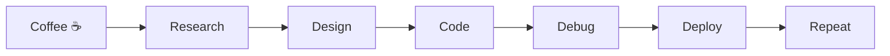

<div align="center">

#  Hey, I'm Aarnav


</div>

---

# ⚡ About Me

```yaml
Name: Aarnav
Age: Student
Focus:
  - Artificial Intelligence
  - Machine Learning
  - Full Stack Development
  - Data Science
  - Open Source
Goal:
  Build products that people actually use.
Current Mission:
  Creating ULTRON from scratch.
```

---

# 🚀 Current Projects

<table>
<tr>
<td width="50%">

## 🤖 ULTRON

Building a complete AI ecosystem.

✔ AI Agents

✔ Model Marketplace

✔ AI Workspace

✔ Zero Budget Challenge

</td>

<td width="50%">

## 🧠 StrokeSense AI

AI powered Stroke Prediction Platform

• FastAPI

• Scikit Learn

• Next.js

• Supabase

</td>

</tr>
</table>

---

# 💻 Tech Stack

<p align="center">


</p>

---

# 📊 GitHub Analytics

<p align="center">


</p>

<p align="center">


</p>

---

# 🧠 Currently Learning

```text
████████████████████░░░░ 85%

Machine Learning
Deep Learning
FastAPI
Next.js
AI Agents
System Design
```

---

# ⚙️ My Workflow



---

# 🌌 Developer Quote

> "Code is temporary. Systems are forever."

---

# 🎯 2026 Goals

- [ ] Build ULTRON
- [ ] Publish AI Projects
- [ ] Contribute to Open Source
- [ ] Learn Advanced ML
- [ ] Win Hackathons
- [ ] Build a Startup

---

# 🏆 GitHub Trophies

<p align="center">


</p>

---

# 🌍 Connect

<p align="center">

<a href="https://github.com/Aarnav446">

</a>

</p>

---

<div align="center">


### ⭐ Thanks for visiting ⭐


</div>
